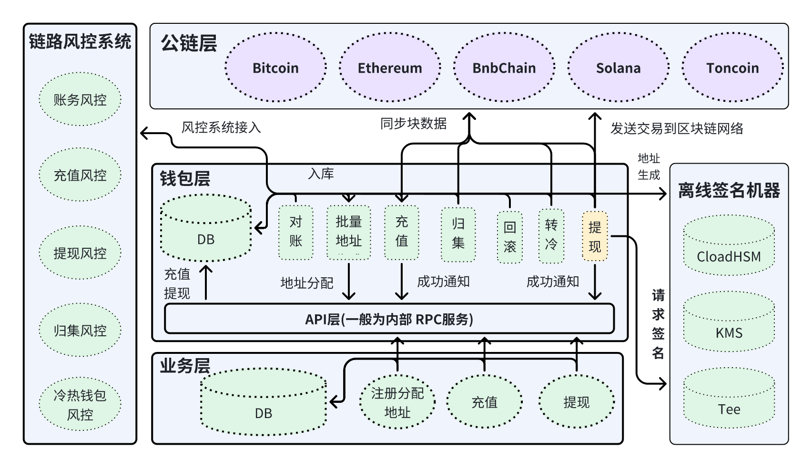
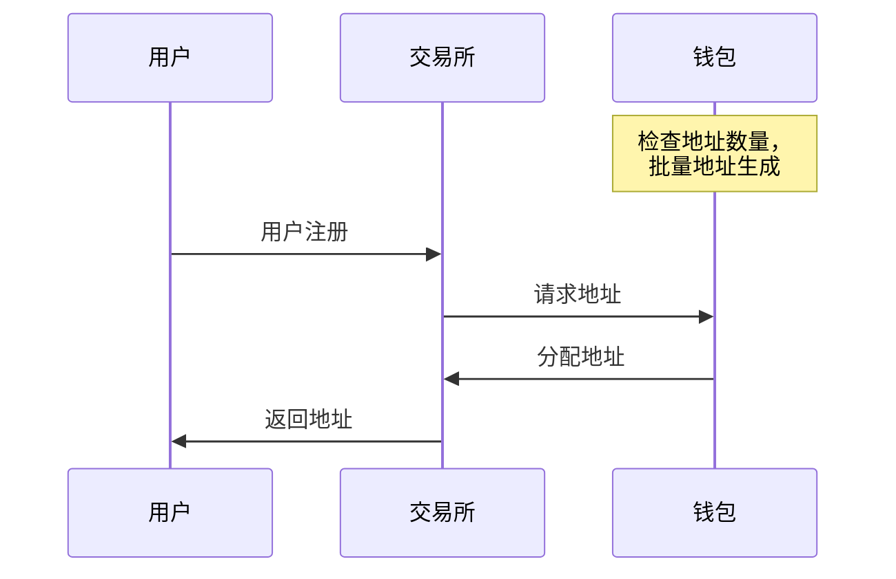
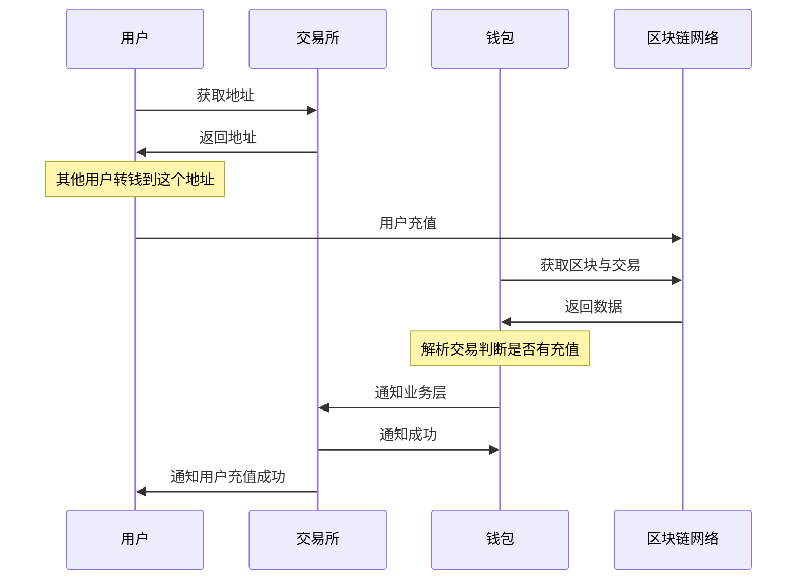
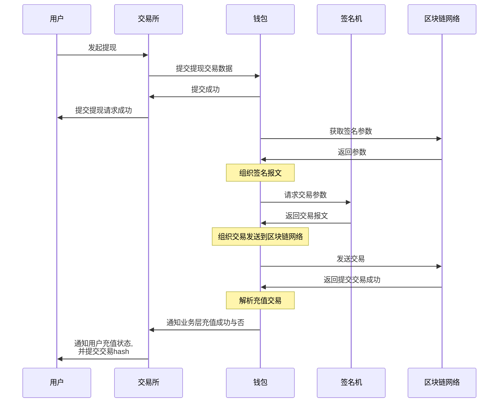
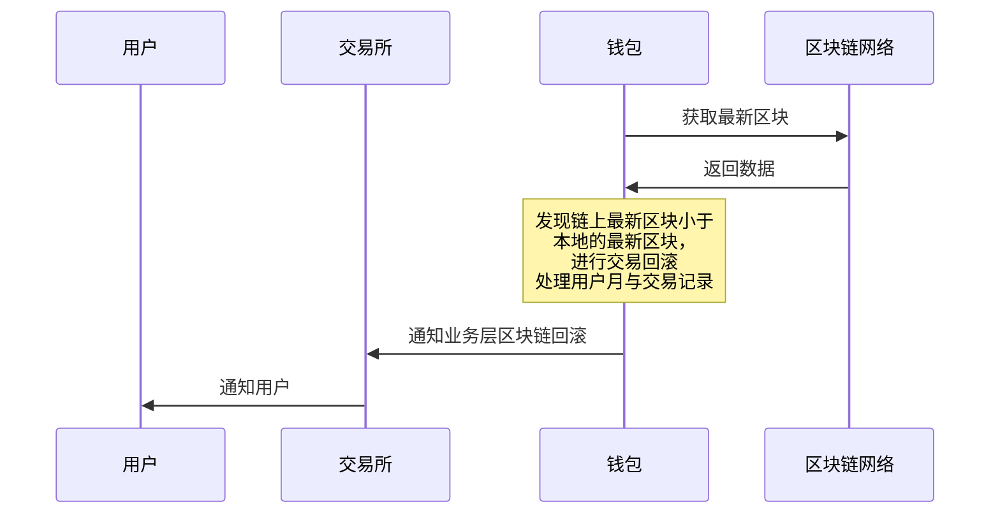

# 1. 3. 中心化钱包架构图

从上面的架构图中，我们可以看到，对于交易所钱包来说，通常有这些业务流程
- 批量地址生成
- 充值
- 提现
- 归集
- 热转冷
- 冷转热
- 链路风控

很多公司钱包开发，一般就是一个人负责整条链钱包的调研(离线地址生成，离线交易签名和扫块出入金)，开发（含充值，提现，归集，热转冷等功能开发，甚至含链路风控的一部分代码）和测试。当然，也有的公司分为三到四团队，调研和离线签是一个团队，扫链出入金，归集和转冷等功能是一个团队，链路风控是一个团队，测试是一个团队。不管怎么分，运维和开发是隔离的，这样做才能做大限度做到人为风控。

# 2 中心化钱包业务细节流程
## 1. 批量地址生成：
交易所钱包为了性能和快速响应用户，所有交易所钱包都会有一个地址池，地址池里面每次生成成千上万的地址，当用户注册到交易所的时直接给用户分配地址，而不是去生成；当地址池里面的地址少于一定数量时就会去新生成一批。

## 2.充值
扫链服务扫区块链，解析区块里面的交易数据，当交易数据里面的 `to` 地址是**系统里的用户地址**时，就说明有**用户充**值；充值这个过程除了**钱包充值扫块**之外，还会和**风控**一起联合，只有**风控系统和钱包都认可**这笔交易，才会通知业务层；解析的时候需要注意有人构造恶意交易，有的链是可以构造交易攻击的。

## 3.提现
客户端用户输入要提现的地址，金额，链；  
这些数据将进入交易所业务层，业务层提交数据给钱包，并建立签名参数风控； 
钱包拿到交易数据之后先验证是否能过风控，没有问题的去链上获取签名参数， 
组织交易之后生成待签名的交易报文，将交易报文递给签名机， 
签名机签名之后返回签名的交易报文，钱包服务组织交易之后发送到区块链网络。 
交易发送完成之后，扫链服务扫到这笔交易之后，验证风控， 
通过之后通知业务层提现成功，上报交易 Hash 等信息。 

## 4. 归集
把用户地址里面的资金全部归集到一个**规整地址**里面去，归集是一个**批量转账**的过程，和提现的逻辑比较类似，就是业务类别不一样，这里就不再画流程图了
## 5. 转冷
将归集地址里面的资金转到一个**冷钱包**，归集是一个**单笔转账**的过程，和提现的逻辑比较类似，就是业务类别不一样，这里就不再画流程图了。
## 6. 冷转热
从冷钱包将资金转到热钱包，手动操作的过程
## 7. 交易回滚
交易回滚是指区块链网络的区块回滚或者重组，需要将钱包系统中的交易处理掉的过程， 
比方说：现在有一条链区块一下从 1000 个块回滚到 500 个块，那么钱包系统里面存储的 **500-1000** 个块的交易就是无效交易了，需要处理在这个块范围的所用用户的交易。

