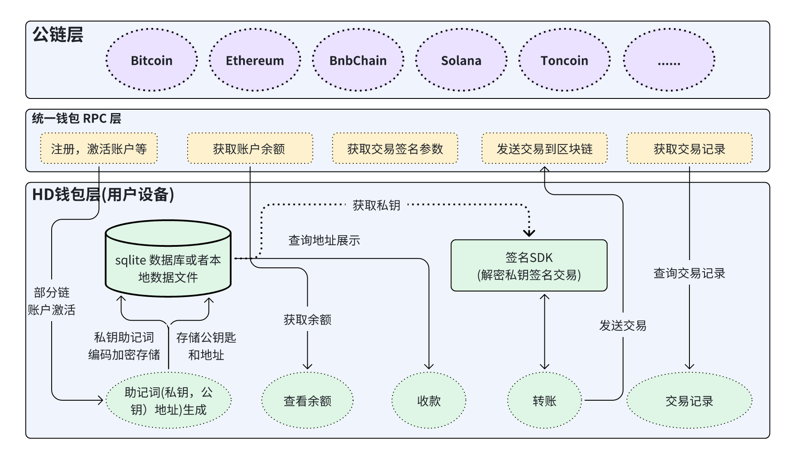
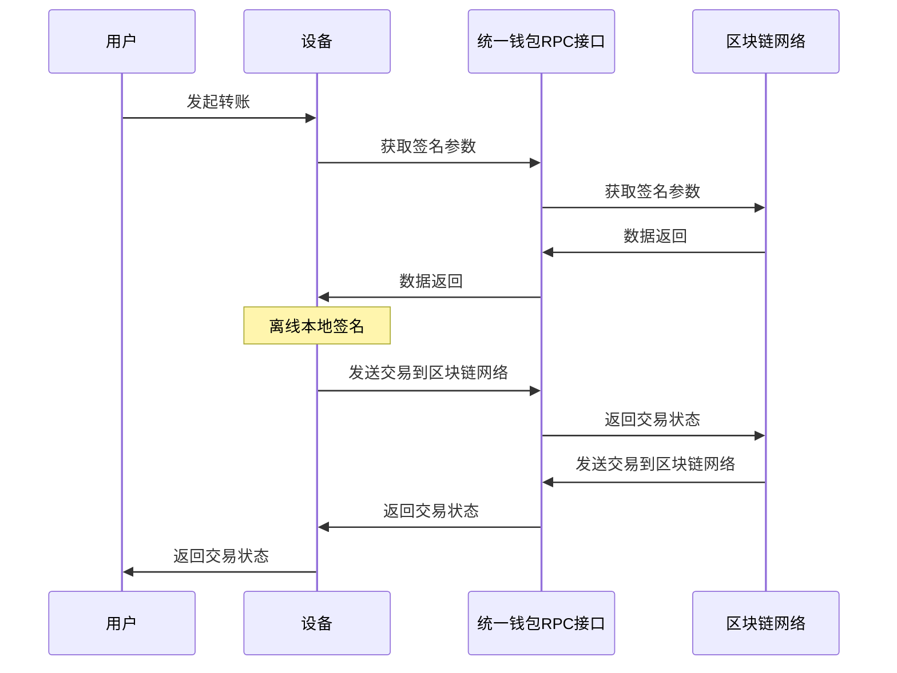

# 1. 去中心化钱包架构图

去中心化钱包的私钥是管理在用户设备中的，除了用户本人和牛逼的黑客，没有人接触得到。 
一般的去中心化钱包都是**确定性分层钱包**；
1. 先生成助记词，
2. 助记词导出主私钥，
3. 主私钥扩展子私钥和公钥匙的方式，
4. 公钥再导出地址。

去中心化钱包的私钥一般是加密之后存储在本地设备 `sqlite` 或者`数据文件`里面，当要签名交易的时候，需要用户输入密码解密私钥之后再签名。

去中心化钱包一般有以下几个业务流程：
- 收款
- 转账
- 转账记录
- 闪兑
- Dapp 浏览器

去中心化钱包比较出名的有 Tp，ImToken，MetaMask 等

# 2. 去中心化钱包细节业务流程
## 1. 收款
查询本地设备数据库把地址展示到界面上。
## 2. 转账

## 3. 转账记录
根据地址查询交易记录和根据 Hash 查询交易详情
## 4. 闪兑
钱包里面的闪兑一般对接 `1inch` 或者其他的 `aggrator` 实现兑换功能
## 5. Dapp 浏览器
Dapp 浏览器是指 Dapp 可以在里面运行，能够正常的和钱包进行交互，有以下几种主流的实现方式
  - `Web View` 中包裹 Dapp, 通过 Js 注入 `Windows` 对象的方式通信，一般钱包开发直接使用这种方式
  - `Websocket` 进行 Dapp 和钱包之间的通信