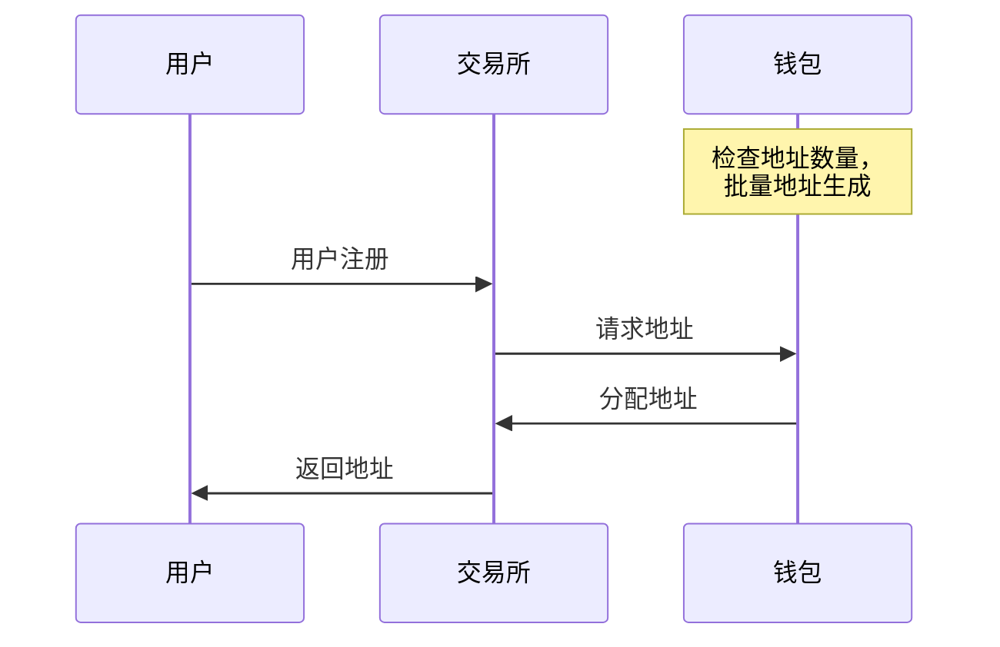
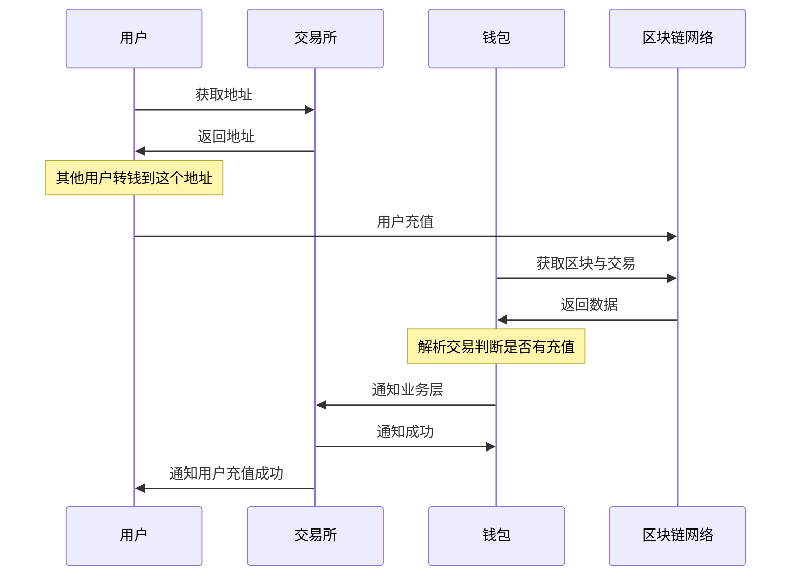
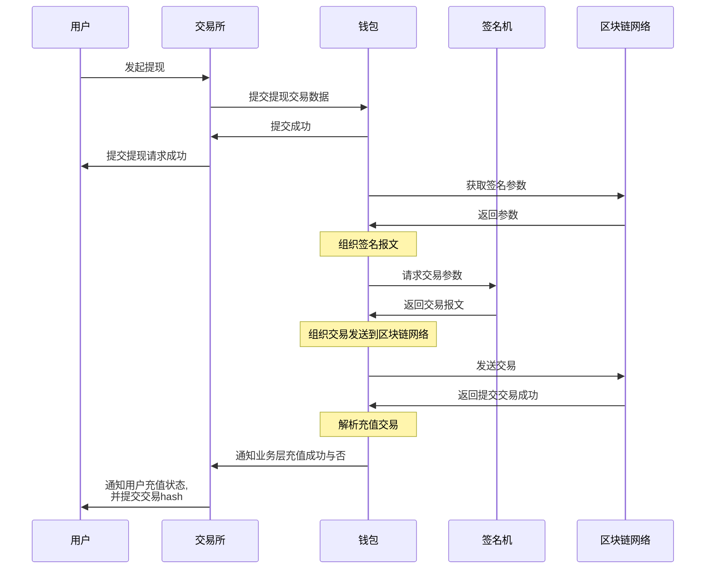
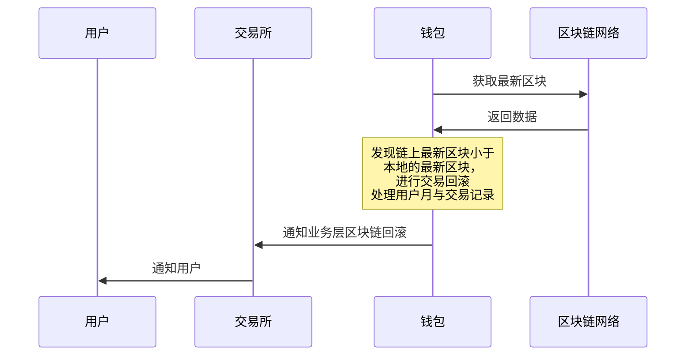

# 用户地址生成

```mermaid
sequenceDiagram
  participant User as 用户
  participant Exchange as 交易所
  participant Wallet as 钱包

  Note over Wallet: 检查地址数量，<br/> 批量地址生成

  User ->> Exchange: 用户注册
  Exchange ->> Wallet: 请求地址
  Wallet ->> Exchange: 分配地址
  Exchange ->> User: 返回地址

```
# 充值

```mermaid
sequenceDiagram
  participant User as 用户
  participant Exchange as 交易所
  participant Wallet as 钱包
  participant Blockchain as 区块链网络

  User ->> Exchange: 获取地址
  Exchange ->> User: 返回地址

  Note over User: 其他用户转钱到这个地址

  User ->> Blockchain: 用户充值

  Wallet ->> Blockchain: 获取区块与交易
  Blockchain ->> Wallet: 返回数据

  Note over Wallet: 解析交易判断是否有充值

  Wallet ->> Exchange: 通知业务层
  Exchange ->> Wallet: 通知成功

  Exchange ->> User: 通知用户充值成功
```
# 提现

```mermaid
sequenceDiagram
  participant User as 用户
  participant Exchange as 交易所
  participant Wallet as 钱包
  participant Signer as 签名机
  participant Blockchain as 区块链网络

  User->>Exchange: 发起提现
  Exchange->>Wallet: 提交提现交易数据
  Wallet->>Exchange: 提交成功
  Exchange->>User: 提交提现请求成功

  Wallet->>Blockchain: 获取签名参数
  Blockchain->>Wallet: 返回参数

  Note over Wallet: 组织签名报文

  Wallet->>Signer: 请求交易参数
  Signer->>Wallet: 返回交易报文

  Note over Wallet: 组织交易发送到区块链网络

  Wallet->>Blockchain: 发送交易
  Blockchain->>Wallet: 返回提交交易成功

  Note over Wallet: 解析充值交易

  Wallet->>Exchange: 通知业务层充值成功与否
  Exchange->>User: 通知用户充值状态, <br/> 并提交交易hash

```
# 交易回滚

```mermaid
sequenceDiagram
  participant User as 用户
  participant Exchange as 交易所
  participant Wallet as 钱包
  participant Blockchain as 区块链网络

  Wallet ->> Blockchain: 获取最新区块
  Blockchain ->> Wallet: 返回数据

  Note over Wallet: 发现链上最新区块小于<br/>本地的最新区块，<br/> 进行交易回滚 <br/> 处理用户月与交易记录

  Wallet ->> Exchange: 通知业务层区块链回滚
  Exchange ->> User: 通知用户
```