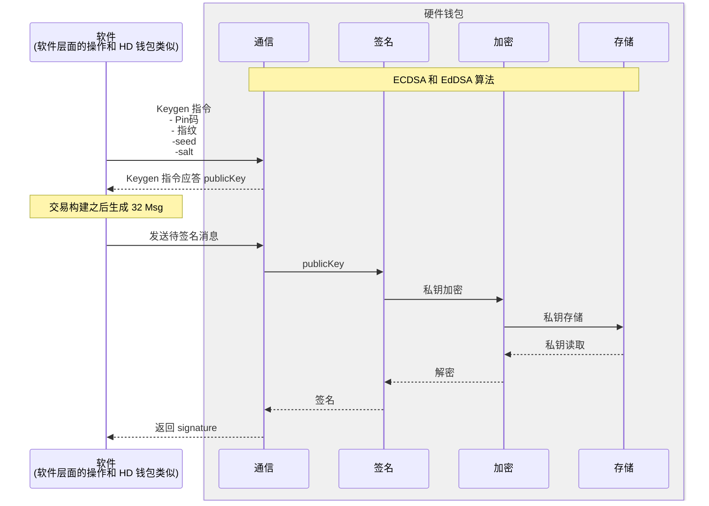

# 硬件钱包签名流程

```mermaid
sequenceDiagram
    participant Software as 软件<br/>(软件层面的操作和 HD 钱包类似)
    
    box rgb(240, 240, 240) 硬件钱包
        participant Communication as 通信
        participant Sign as 签名
        participant Encrypt as 加密
        participant Storage as 存储
    end
    
    Note over Communication,Storage: ECDSA 和 EdDSA 算法

    Software ->> Communication: Keygen 指令<br/>- Pin码<br/>- 指纹<br/>-seed<br/>-salt
    Communication -->> Software: Keygen 指令应答 publicKey
    
    Note over Software: 交易构建之后生成 32 Msg
    Software ->> Communication: 发送待签名消息
    
    Communication ->> Sign: publicKey
    Sign ->> Encrypt: 私钥加密
    Encrypt ->> Storage: 私钥存储
    Storage -->> Encrypt: 私钥读取
    Encrypt -->> Sign: 解密
    Sign -->> Communication: 签名
    
    Communication -->> Software: 返回 signature
```
